# c2z (Container to Zone)

**Kubernetes Based Penetration Testing Lab**

```mermaid
stateDiagram-v2

state "<pre><code>  
                                       
                                ,----, 
  ,----..        ,----,       .'   .`| 
 /   /   \     .'   .' \   .'   .'   ; 
|   :     :  ,----,'    |,---, '    .' 
.   |  ;. /  |    :  .  ;|   :     ./  
.   ; /--`   ;    |.'  / ;   | .'  /   
;   | ;      `----'/  ;  `---' /  ;    
|   : |        /  ;  /     /  ;  /     
.   | '___    ;  /  /-,   ;  /  /--,   
'   ; : .'|  /  /  /.`|  /  /  / .`|   
'   | '/  :./__;      :./__;       :   
|   :    / |   :    .' |   :     .'    
 \   \ .'  ;   | .'    ;   |  .'       
  `---`    `---'       `---'           
                                                   
</pre></code>" as c2z

style c2z fill:#c4f452, color: #000, width: 100vw, font-weight: bold
```



# English Version

`c2z` is an automated penetration testing lab that operates in a **Kubernetes-native environment**. It is designed to enable security researchers and learners to quickly and easily deploy and practice realistic attack/defense scenarios.

## Key Features

- **Rapid Deployment**: Container-based environment setup in seconds
- **Resource Efficiency**: Significantly lower resource consumption compared to virtual machines
- **One-Click Installation**: Easy setup through Helm and automated scripts
- **Scenario-Based**: Provides various scenarios including Web vulnerabilities, Container Escape, Network Attack, and more
- **Monitoring Integration**: Real-time observability through Prometheus, Grafana, and Loki

## Guide

[c2z guide](https://github.com/s2n0n/c2z/blob/main/guide.mdx) 

- For detailed guide, please read `/guide.mdx` 

## Installation

### Prerequisites

- **Linux**: Ubuntu/Debian recommended
- **macOS**: **Docker Desktop** installation required (uses `k3d`)
- Minimum 16GB RAM, 4 vCPU, 50GB Disk
- `curl`, `python3` installation required

### Installation

Running the installation script from the project root will automatically install K3s, Helm, and the c2z base environment.

```bash
chmod +x install.sh
./install.sh
```

## Usage (CLI)

You can manage scenarios using the `c2z-cli` tool.

### Installing Dependencies

```bash
pip install -r requirements.txt
```

### Commands

- **List scenarios**

  ```bash
  ./c2z-cli list
  ```

- **Deploy scenario**

  ```bash
  ./c2z-cli deploy web-vuln
  ```

- **Delete scenario**

  ```bash
  ./c2z-cli delete web-vuln
  ```

- **Check status**
  ```bash
  ./c2z-cli status
  ```

## Folder Structure

```
c2z/
├── charts/                     # Helm Charts directory
│   └── c2z/                    # Main c2z chart
│       ├── templates/          # Kubernetes Manifest templates
│       │   ├── attacker-zone/  # Attacker (Kali) environment resources
│       │   ├── monitoring/     # Monitoring stack (Prometheus, Grafana, etc.)
│       │   ├── scenarios/      # Scenario definitions
│       │   │   └── web-vuln/   # Web vulnerability scenario (DVWA, JuiceShop)
│       │   ├── namespaces.yaml # Namespace definitions
│       │   ├── network-policies.yaml # Network isolation policies
│       │   └── resource-quotas.yaml  # Resource limit policies
│       ├── Chart.yaml          # Chart metadata
│       └── values.yaml         # Default configuration values (images, resources, etc.)
├── install.sh                  # One-click installation script
├── c2z-cli                     # CLI management tool (Python)
├── plan.md                     # Project planning and design document
├── requirements.txt            # CLI Python dependencies
└── README.md                   # Project documentation
```

## Scenario List

### 1. Web Application Vulnerabilities (web-vuln)

- **Target**: DVWA, OWASP Juice Shop
- **Learning Content**: Web security fundamentals including SQL Injection, XSS, CSRF, etc.

### 2. Container Escape (container-escape)

- **Target**: Privileged Pod, Docker Socket Mount
- **Learning Content**: Container escape techniques practice (implementation planned)

### 3. Network Attack (network-attack)

- **Target**: Legacy Services (Telnet, FTP)
- **Learning Content**: ARP Spoofing, MITM, Denial of Service attacks (implementation planned)

---

# 한국어 버전 Korean

c2z는 Kubernetes 네이티브 환경에서 동작하는 자동화된 침투 테스트 랩입니다. 보안 연구자와 학습자가 실전적인 공격/방어 시나리오를 빠르고 쉽게 배포하고 실습할 수 있도록 설계되었습니다.

## 주요 기능

- **빠른 배포**: 컨테이너 기반으로 수 초 내에 실습 환경 구축
- **리소스 효율성**: 가상머신 대비 현저히 낮은 리소스 점유
- **원클릭 설치**: Helm 및 자동화 스크립트를 통한 간편한 설정
- **시나리오 기반**: Web 취약점, Container Escape, Network Attack 등 다양한 시나리오 제공
- **모니터링 통합**: Prometheus, Grafana, Loki를 통한 실시간 관측 가능

## 설치 방법

### 전제 조건

- **Linux**: Ubuntu/Debian 권장
- **macOS**: **Docker Desktop** 설치 필수 (`k3d` 사용)
- 최소 16GB RAM, 4 vCPU, 50GB Disk
- `curl`, `python3` 설치 필요

### 설치

프로젝트 루트에서 설치 스크립트를 실행하면 K3s, Helm, 그리고 c2z 기본 환경이 자동으로 설치됩니다.

```bash
chmod +x install.sh
./install.sh
```

## 사용 방법 (CLI)

`c2z-cli` 도구를 사용하여 시나리오를 관리할 수 있습니다.

### 의존성 설치

```bash
pip install -r requirements.txt
```

### 명령어

- **시나리오 목록 확인**

  ```bash
  ./c2z-cli list
  ```

- **시나리오 배포**

  ```bash
  ./c2z-cli deploy web-vuln
  ```

- **시나리오 삭제**

  ```bash
  ./c2z-cli delete web-vuln
  ```

- **상태 확인**
  ```bash
  ./c2z-cli status
  ```

## 폴더 구조 구조

```
c2z/
├── charts/                     # Helm Charts 디렉토리
│   └── c2z/                    # 메인 c2z 차트
│       ├── templates/          # Kubernetes Manifest 템플릿
│       │   ├── attacker-zone/  # 공격자(Kali) 환경 리소스
│       │   ├── monitoring/     # 모니터링 스택 (Prometheus, Grafana 등)
│       │   ├── scenarios/      # 시나리오 정의
│       │   │   └── web-vuln/   # Web 취약점 시나리오 (DVWA, JuiceShop)
│       │   ├── namespaces.yaml # 네임스페이스 정의
│       │   ├── network-policies.yaml # 네트워크 격리 정책
│       │   └── resource-quotas.yaml  # 리소스 제한 정책
│       ├── Chart.yaml          # 차트 메타데이터
│       └── values.yaml         # 기본 설정 값 (이미지, 리소스 등)
├── install.sh                  # 원클릭 설치 스크립트
├── c2z-cli                  # CLI 관리 도구 (Python)
├── plan.md                     # 프로젝트 기획 및 설계 문서
├── requirements.txt            # CLI Python 의존성
└── README.md                   # 프로젝트 문서
```

## 시나리오 목록

### 1. Web Application 취약점 (web-vuln)

- **대상**: DVWA, OWASP Juice Shop
- **학습 내용**: SQL Injection, XSS, CSRF 등 웹보안 기초

### 2. Container Escape (container-escape)

- **Target**: Privileged Pod, Docker Socket Mount
- **학습 내용**: 컨테이너 탈출 기법 실습 (구현 예정)

### 3. Network Attack (network-attack)

- **Target**: Legacy Services (Telnet, FTP)
- **학습 내용**: ARP Spoofing, MITM, 서비스 거부 공격 (구현 예정)

---

**License**: Apache 2.0
